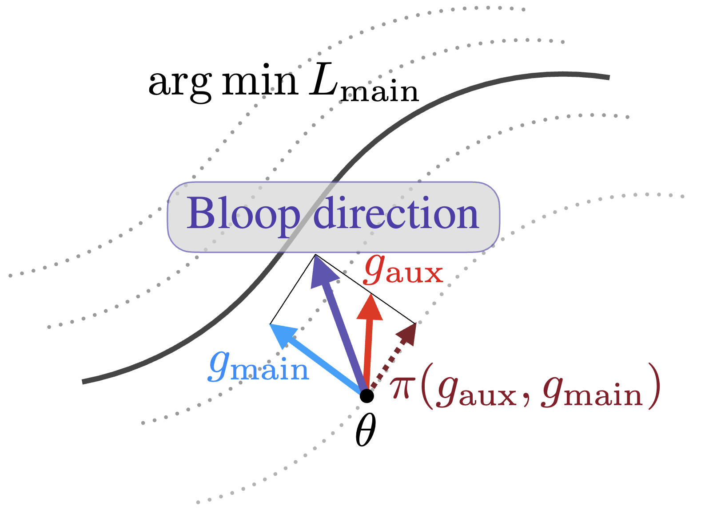

# Careful with that Scalpel: Improving Gradient Surgery with an EMA

*Hsieh, Y.G., Thornton, J., Ndiaye, E., Klein, M., Cuturi, M. and Ablin, P.*

Presented at **International Conference on Machine Learning (ICML), 2024.**

[[`Paper`](https://arxiv.org/abs/2402.02998)]  [[`BibTex`](#citation)]

<p align="center">

</p>

BLOOP (**B**iLevel **O**ptimization with **O**rthogonal **P**rojection) allows to solve problems of the form

$$\min_{\theta}\mathcal{L}\_{aux}(\theta)\\
\text{ s.t. } \theta \in \arg\min\mathcal{L}\_{main}(\theta)$$

This is an alternative form of the most commonly found mixed optimization approach:

$$\min_{\theta}\mathcal{L}\_{main}(\theta)+\lambda\mathcal{L}\_{aux}(\theta)$$

Instead of performing gradient steps in the average direction $\nabla_{\theta}(\mathcal{L}\_{main}+\lambda\mathcal{L}\_{aux})$,
BLOOP perform steps of the form $\nabla_{\theta}\mathcal{L}\_{main}+\lambda\pi(\nabla_{\theta}\mathcal{L}\_{aux},\nabla_{\theta}\mathcal{L}\_{main})$
where $\pi(\nabla_{\theta}\mathcal{L}\_{aux},\nabla_{\theta}\mathcal{L}\_{main})$ is the projection of $\nabla_{\theta}\mathcal{L}\_{aux}$ onto
$\nabla_{\theta}\mathcal{L}\_{main}^{\bot}$, i.e the orthogonal complementary of $\nabla_{\theta}\mathcal{L}\_{main}$.

This ensures that at the 1st order the gradient step still follows the optimal direction for the main loss, while optimizing the auxiliary loss
as a secondary objective. Since the gradients are stochastic, the space $\nabla_{\theta}\mathcal{L}\_{main}^{\bot}$ is not easy to estimate from
mini-batches. BLOOP solves this issue by using an Exponential Moving Average (EMA) of the descent direction to have a better estimate of $\nabla_{\theta}\mathcal{L}\_{main}$ from mini-batches only.


## 🛠️ Installation

You need to have Python 3.9 or newer installed on your system.

Install the latest development version with:

```bash
pip install git+https://github.com/apple/ml-bloop
```

## 🚀 Getting started

Including BLOOP into your pipeline only amounts to a few lines of code changes.

### Initialization

The algorithm maintains a `BloopState` containing the current EMA of the descent direction, that can be built with the `init_bloop` method.

```python
import jax
from bloop.optim import init_bloop

params = ...  # params of your model, can be a jax array or a pytree

key = jax.random.PRNGKey(0)
ema = 0.1  # weight of EMA update
lbda = 0.1  # weight of auxiliary gradient
init = "zeros"  # can also be "random" or "gradients"

bloop_state = init_bloop(key, params, ema=ema, lbda=lbda, init=init)
```

### Training

Multi-task training with BLOOP requires minimal code changes, entailing only a single gradient merging operation.

```python
import jax
from bloop.optim import bloop_direction

def main_loss(...)
  return ...


def aux_loss(...)
  return ...

grad_main = jax.grad(main_loss)(params)
grad_aux = jax.grad(aux_loss)(params)
bloop_grad, bloop_state = bloop_direction(grad_main, grad_aux, bloop_state)

# perform a gradient step on params using bloop_grad
```

## Citation

If you find our work useful, please consider citing us as:

```bibtex
@article{hsieh2024careful,
  title={Careful with that Scalpel: Improving Gradient Surgery with an EMA},
  author={Hsieh, Yu-Guan and Thornton, James and Ndiaye, Eugene and Klein, Michal and Cuturi, Marco and Ablin, Pierre},
  booktitle={International Conference on Machine Learning},
  year={2024},
  organization={PMLR}
}
```
